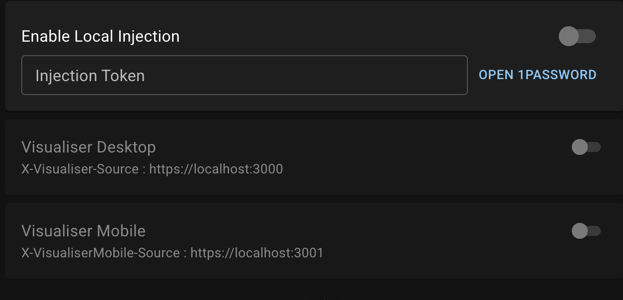
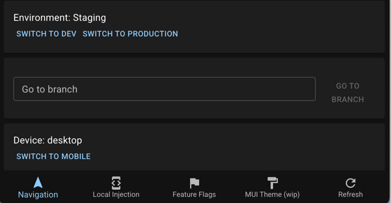

# Visualsier Developer Extension 

The documentation here is still pretty sparse. 

## Main features 

* Header injection for local development

* Navigating between staging/dev/production

* ~~Custom npm client for injecting into the vis~~ this was a bad idea

## Running locally 

Compile the extension with `pnpm run build`. Add that extension to chrome via 
chrome extension devtools (load unpacked extension)

